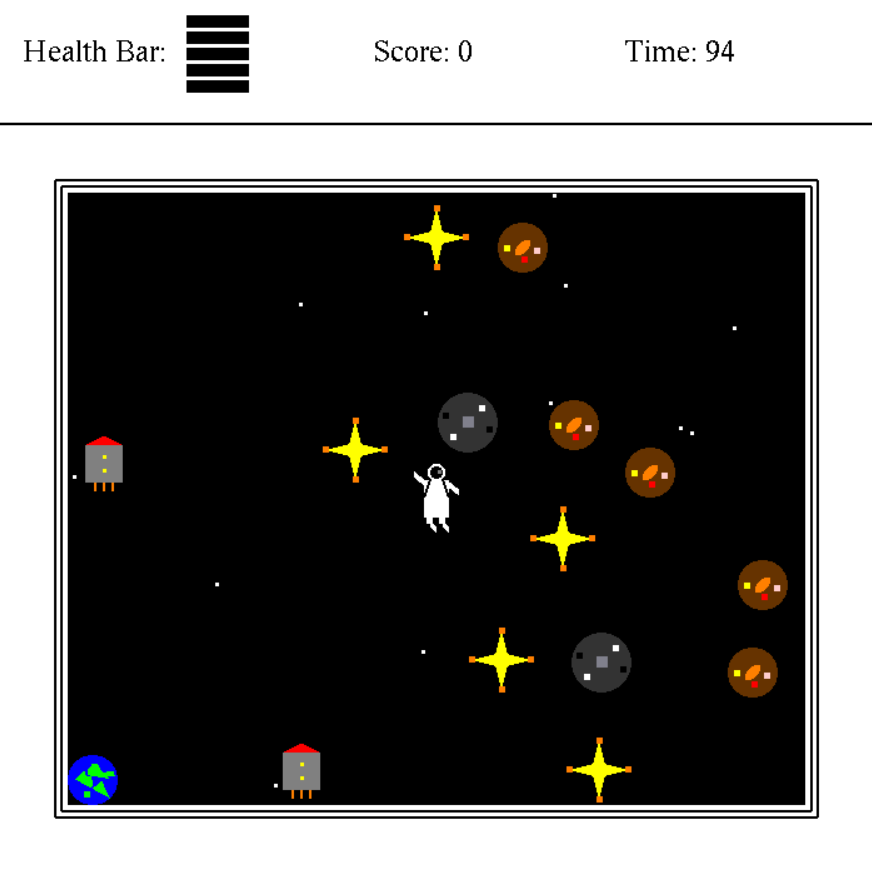

# Galactic Gatherer 🚀✨



## Description

Galactic Gatherer is an exciting C++ game where players take on the role of an astronaut exploring the vastness of space. The mission is to collect stars while navigating through cosmic obstacles. Two power-ups, the Moon and the Rocket, add an extra layer of challenge and excitement.

## Features

- 🌟 Collect stars and dodge obstacles to maximize your score.
- 🌕 **Moon Power-up:** Activate the Moon to earn double points for every star collected within 5 seconds.
- 🚀 **Rocket Power-up:** Activate the Rocket to increase your speed twofold for 5 seconds.
- 🌍 Your goal is to return to Earth with the highest possible score before the game time ends.

## How to Play

1. **Clone the repository:** `git clone https://github.com/George-Elhamy/Galactic-Gatherer.git`

2. **Build and Run the Game:**

**Using Visual Studio (Windows):**
- Open `OpenGL2DTemplate.sln` using Visual Studio.
- Build the project within the Visual Studio IDE.
- Run the compiled executable directly from the IDE.

**Using MSBuild (Command Line):**
- Open a Developer Command Prompt for Visual Studio or a command prompt with MSBuild in the path.
- Navigate to the directory containing your solution file.
- Execute the following command:
  ```
  msbuild OpenGL2DTemplate.sln
  ```
- After a successful build, find the compiled executable and run it manually.


## Controls

- Use arrow keys to navigate the astronaut.
- You have to collide with the collectables and powerups to collect them.
- You have to collide with Earth to finish the game.

## Scoring

- Regular star: 100 points
- Moon-boosted star: 250 points (during Moon power-up)
- Other obstacles: Avoid them to maintain your health.


